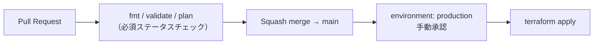

# VideoGarage

> 複数の動画プラットフォームを横断してブックマークできる、フルサーバーレス構成の動画ライブラリ

**https://videogarage.jp**


<!-- TODO: スクリーンショット（トップ画面）とデモGIF（ホバー再生→ピン留め→並び替え）を撮影して差し替え -->


---

## 目次

**プロジェクトを知る**

- [概要](#概要)
- [主な機能と使い方](#主な機能と使い方)
- [アーキテクチャ](#アーキテクチャ)
- [技術スタック](#技術スタック)
- [CI/CD](#cicd)
- [技術的な意思決定](#技術的な意思決定)
- [セキュリティ対策](#セキュリティ対策)
- [苦労した点と解決](#苦労した点と解決)
- [既知の制約・今後の予定](#既知の制約今後の予定)

**動かす・詳細を見る**

- [データ設計](#データ設計)
- [開発運用](#開発運用)
- [セットアップ（環境再現）](#セットアップ環境再現)
- [設定・環境変数](#設定環境変数)
- [ディレクトリ構成](#ディレクトリ構成)

---

## 概要

「見たい動画があちこちのプラットフォームに散らばっていて、一覧で管理したい」という個人的な課題から出発したWebアプリです。YouTube / Vimeo / Twitch / 直接mp4のURLを登録し、プレイリスト単位で整理できます。

同時に、認証・認可・データ設計・配信・IaC・CI/CDというクラウド構築の一連の要素を、チュートリアルではなく自分の課題に対して設計から運用まで通しで実践することを目的にしています。

- 構成: フルサーバーレス（Lambda 6関数 / DynamoDB 2テーブル / Lambda実行ロール4種）
- インフラ: 全リソースをTerraformで管理。コンソールで先行構築した既存環境を39リソースのbrownfield importで回収し、`terraform plan` 差分ゼロを平常状態として維持
- デプロイ: GitHub Actions + OIDC（アクセスキー不使用）による承認ゲート付き自動apply。plan用 / apply用の2ロールを分離
- 月額運用コスト: **約 $0.5**（Route 53 ホストゾーン費が大半。CloudFrontは無料プラン、他は無料利用枠内）

---

## 主な機能と使い方

| 機能 | 説明 |
|------|------|
| マルチプラットフォーム対応 | YouTube / Vimeo / Twitch（配信・クリップ）/ mp4 をURL判定で自動振り分け |
| プレビュー再生 | ホバーでミュート再生、クリックで固定再生 |
| プレイリスト管理 | 動画をプレイリスト単位でカテゴリ分け（作成・リネーム・削除） |
| 並び替え | ドラッグ＆ドロップ。順序はサーバーに永続化（スマホは長押しでドラッグ） |
| ゲスト / ログイン | 未ログインはローカル保存、ログインでクラウド同期 |
| データ移行 | ゲスト時のデータをログイン時に自動でクラウドへ移行 |
| セッション自動更新 | リフレッシュトークンによるサイレント更新で、操作中にログインが途切れない |

**使い方**: https://videogarage.jp を開き、動画のURL（例: `https://www.youtube.com/watch?v=...`）を貼って「+ Add video」を押すだけです。アカウント登録なしでもすべての機能が使え、サインインすると保存済みのデータがそのままクラウドに引き継がれます。

---

## アーキテクチャ


リクエストの流れは3系統に分かれます。

1. **配信**: Route 53（A / AAAA alias）→ CloudFront（ACM証明書でTLS終端・WAF）→ S3。S3へはOAC経由のみアクセス可能
2. **認証**: Cognito Hosted UIの認可コードフローでトークンを取得。IDトークンは30分の短命とし、リフレッシュトークンでサイレント更新
3. **API**: API GatewayのJWTオーソライザーが署名・issuer・audienceを検証してからLambdaを起動し、DynamoDBへ読み書き

動画の再生トラフィックは各プラットフォームの埋め込みプレイヤーが直接ロードするため、自前のインフラを一切通りません。再生数が増えても転送コストが発生しない構成です。

---

## 技術スタック

| 領域 | 技術 | 役割 |
|----------|------|------|
| フロントエンド | Vanilla JavaScript（ES Modules） | フレームワーク非依存のSPA。プラットフォーム判定は `platform.js` に分離 |
| 認証 | Cognito | 認可コードフロー・JWT発行・リフレッシュトークン |
| API | API Gateway（HTTP API） | JWTオーソライザーによる認可 |
| 処理 | Lambda（Python 3.14）×6 | 動画・プレイリスト各3関数のCRUD |
| データ | DynamoDB ×2 | オンデマンド課金・削除保護・PITR有効 |
| 配信 | S3 + CloudFront | 静的ホスティング（OACでS3直アクセス遮断） |
| ドメイン | Route 53 + ACM | 独自ドメイン・HTTPS化（A/AAAA両対応） |
| IaC | Terraform（リモートstate: S3 + ネイティブロック） | 全リソースのコード管理 |
| CI/CD | GitHub Actions + OIDC | plan検証と承認ゲート付き自動apply |

---

## CI/CD

GitHub Actions で Terraform の実行を自動化しています。認証は **OIDC**（GitHubの短命トークンをAWSの一時クレデンシャルに交換）で、アクセスキーは一切保存していません。

<!-- TODO: deploy.yml に CloudFront キャッシュ無効化ステップが実装済みか未確認のため、図から一旦外している。
     実装済みであれば `APPLY --> INV[CloudFront キャッシュ無効化]` を復活させる。未実装なら「今後の予定」に残す。 -->



- **ロール分離**: plan用（読み取り専用）と apply用（承認済み環境のジョブのみ引き受け可能）の2ロール構成。信頼ポリシーの `sub` クレーム条件で、PRイベントからは読み取りロールしか使えないことをAWS側で強制
- **plan差分ゼロの維持**: applyしていないのに差分が出る＝ドリフトの検知器として機能させる運用

---

## 技術的な意思決定

### DynamoDB vs RDS

**DynamoDBを選択。** データ構造が「ユーザーに紐づく動画・プレイリスト」というシンプルなキー設計で、リレーションが不要なため。RDSは最小構成でも固定費が発生し、Lambdaとのコネクション管理も煩雑になる。さらにRDSを選ぶとLambdaをVPC内に置くことになり、外部通信のためのNAT Gateway費用（固定費）まで連鎖する。DynamoDBならVPC自体が不要で、オンデマンド課金によりアクセスがなければコストがほぼゼロになる。

### テーブル設計とユーザー間のデータ分離

エンティティ境界（プレイリスト / 動画）で2テーブルに分割し、どちらも`userId`（Cognitoの`sub`）をパーティションキーにすることで、ユーザー単位の論理分離をアプリロジックではなくキー設計そのもので担保している。1ユーザーの全件取得はQuery 1回で完結する。現状の規模ではGSIを追加せず、プレイリストによる絞り込みはクライアント側で行う判断とした。

### 認証の責務分離

API GatewayのJWTオーソライザーでトークン検証を完結させ、Lambda側には認証ロジックを持たせない設計。検証に失敗したリクエストはLambdaに到達しないため、不正トラフィックがコンピュートコストに転嫁されない。Lambdaは検証済みの`sub`（ユーザーID）を受け取るだけなので、各関数の責務がCRUDに集中する。

### セッション設計

IDトークンは30分の短命に保ち、漏えい時の被害を最小化。期限の60秒前にサイレント更新し、401時も1回だけ再取得してリトライすることで、体感上ログインが途切れないUXと短命トークンを両立している。更新処理は多重実行を1本に集約（single-flight）し、サインアウト時はリフレッシュトークンを失効させる。

<!-- TODO: 認可コードフローで PKCE（code_challenge / code_verifier）を使っているかを確認して記載する。
     使っている場合: 「クライアントシークレットを持てないパブリッククライアントのため、認可コード横取り対策としてPKCEを併用」と本節に追記。
     使っていない場合: この行は削除し、「既知の制約」のPKCE項目を残す。 -->

### 最小権限の原則（IAM）

Lambda関数の種別ごとにロールを4分離し、必要なActionのみを許可。加えてCI/CD用にplan用・apply用の2ロールを分離している（合計6ロール）。

| ロール | 対象関数 | 許可するAction |
|------|------|---------------|
| read | get系 2関数 | `dynamodb:Query` |
| write | post系 2関数 | `dynamodb:PutItem` |
| video-delete | 動画削除 | `dynamodb:DeleteItem` |
| tabs-delete | プレイリスト削除 | `dynamodb:Query`, `dynamodb:BatchWriteItem`（配下の動画をカスケード削除） |

### ゲストモードの設計

未ログインでもlocalStorageで全機能が使えるようにし、参入障壁を下げた。ログイン時にはローカルデータをDynamoDBへ移行する処理を実装し、ゲストからの移行体験を損なわないようにしている。

---

## セキュリティ対策

- S3はOAC（Origin Access Control）でCloudFront経由のみ許可し、バケットポリシーの`AWS:SourceArn`条件で自ディストリビューションに限定
- 認可はAPI Gateway層で完結し、未認証リクエストはLambdaを起動させない
- IAMは操作単位の4ロール分離（上表）＋ CI/CD用のplan/applyロール分離
- フロントエンドは全属性のエスケープとイベント委譲を徹底し、URL経由のスクリプト注入（XSS）のリスクを軽減
- サインアウト時にリフレッシュトークンをrevokeし、端末に残るトークンを無効化
- DynamoDBは削除保護とポイントインタイムリカバリ（35日）を有効化

---

## 苦労した点と解決

### 1. コンソール先行構築環境のTerraformへの回収（brownfield import）

最初はコンソールで構築して公開まで到達したが、後から書いたTerraformコードは一度もapplyされておらず、stateの不在・実在しない属性名・APIステージ名の食い違いなど、コードと実環境の乖離が多数見つかった。実環境をAWS CLIで棚卸しし、CLIでの逐次importが`for_each`の評価順の問題で構造的に失敗することを突き止めて`import`ブロックによる一括取り込みへ方針転換。39リソースをimportし、環境変数・WAF紐付けなどコード側を実物に合わせて修正して、`terraform plan`の差分ゼロ（No changes）を達成した。以後はplan差分をドリフト検知器として運用している。

### 2. OIDCのsubクレームとenvironment承認の不一致

deploy.ymlに`environment: production`を指定すると、GitHubが発行するOIDCトークンの`sub`クレームが`repo:...:environment:production`形式に変わり、`ref:refs/heads/main`前提で書いたIAM信頼ポリシーと一致せずAssumeRoleが拒否された。信頼ポリシーの条件をenvironmentベースに変更して解決。承認ゲートと認証条件が連動していることを実地で学んだ。

### 3. 同一URL動画の競合と、そこから見つかったXSS脆弱性

動画の一意キー（uid）をURLベースで生成していたため、別プレイリストに同じ動画を追加すると同一扱いになり削除が連動する不具合が発生。調査の過程で、URL全体がuidとしてHTML属性へ未エスケープのまま展開されており、細工したURLでスクリプト注入が成立し得ることも判明した。uidを乱数ベースに変更して重複チェックは`動画ID + プレイリストID`に分離し、全属性のエスケープとインラインイベントハンドラの全廃（イベント委譲への移行）で機能バグと脆弱性の両方を解決した。

### 4. リロードのたびにログアウトされる

有効なはずのセッションがページ再読み込みで消える現象が発生。原因はJWTのペイロードがbase64url形式（`-`と`_`を含む）なのに対し、素の`atob()`が標準base64しか受け付けず、デコード例外を「期限切れ」と誤判定していたこと。base64url→base64の変換とパディング補完を実装して解決した。

### 5. サインインのたびにプレイリストが重複生成される

ページ読み込み時にデフォルトプレイリストを作成 → ログイン時にそれがマイグレーションされ続ける、という無限増殖バグが発生。デフォルトプレイリストの生成をログイン状態の判定後に移動することで、状態管理の責務を整理して解決。

### 6. 初期のつまずき

API GatewayのCORS設定で`Allow-Headers`を誤設定してプリフライトが通らなかった件（`Authorization, Content-Type`に修正）、DynamoDBが返す`Decimal`型を`json.dumps()`が変換できずLambdaが500を返した件（`json.JSONEncoder`を継承したカスタムエンコーダーで解決）など。

---

## 既知の制約・今後の予定

**既知の制約**

- 自動テストが未整備。Lambdaハンドラのユニットテスト（pytest + moto）は今後の対応項目として認識している <!-- TODO: pytest導入後はこの行を削除し、「開発運用」にテスト方針を記載する -->
- CloudFrontに紐づくWAF Web ACLはコンソール作成のものをARN直書きで参照している（Terraform管理外）。ディストリビューションが定額プラン加入のためWeb ACLの差し替えがAPIで拒否され、Terraform化は意図的に見送った。実費確認の結果、無料プラン（$0/月）のため現状維持と判断
- リフレッシュトークンはlocalStorageに保存。バックエンドを持たないSPAの標準的な妥協で、XSS対策（全属性エスケープ・イベント委譲）と組み合わせて運用
<!-- TODO: PKCE未使用の場合のみ以下を残す。使用している場合はこの行を削除し「技術的な意思決定 > セッション設計」に記載する
- 認可コードフローでPKCEを併用していない（パブリッククライアント構成のため、認可コード横取り対策として導入を検討中）
-->
- 単一リージョン構成（個人サービスとしてRTO/RPO要件から判断。各サービスは内部的にマルチAZ）
- CloudWatchアラーム（Lambdaエラー率・API 5xx）は未整備

**今後の予定**

| 項目 | 内容 |
|------|------|
| 自動テストの導入 | Lambdaハンドラのユニットテスト（pytest + moto）をCIに組み込む |
| 監視 | Lambdaエラー率・API 5xxのCloudWatchアラーム |
| CIのpaths恒久対応 | docsのみのPRでも必須チェックが解決するよう paths-filter 方式へ変更 |
| Lambdaリファクタ | テーブル名の環境変数参照化・レスポンス整理 |
| 未対応URLの動的承認 | 未対応プラットフォームのURLをSlackに通知し、承認制で許可リストに追加 |

---

## データ設計

### videogarage-videos

| 項目 | 型 | 説明 |
|------|-----|------|
| userId | String | パーティションキー（Cognito sub） |
| videoId | String | ソートキー |
| url | String | 動画URL |
| type | String | プラットフォーム種別 |
| tabId | String | 所属プレイリスト |
| title | String | タイトル |
| addedAt | Number | 追加日時 |
| order | Number | 並び順（ドラッグ＆ドロップの永続化に使用） |

### videogarage-tabs

| 項目 | 型 | 説明 |
|------|-----|------|
| userId | String | パーティションキー（Cognito sub） |
| tabId | String | ソートキー |
| name | String | プレイリスト名 |
| createdAt | Number | 作成日時 |

---

## 開発運用

個人開発のためコントリビューションガイドは設けていませんが、実務を想定した開発フローで運用しています。

- **Conventional Commits** に準拠したコミットメッセージ（日本語）
- **featureブランチ + Squash Merge**（branch rulesetでmainへの直push禁止・Squashのみ許可）
- **PRごとに `Terraform Plan` を必須ステータスチェック**として実行
- **GitHub Issues** でタスク管理

---

## セットアップ（環境再現）

**前提**: AWS CLIの認証済み環境 / Terraform 1.11以上（動作確認: v1.15.8）/ Route 53ホストゾーンとACM証明書（us-east-1）は事前に用意されていること（`data`参照）

```bash
# 1. state保管用バケットの作成（初回のみ・ローカルstate）
cd bootstrap
terraform init && terraform apply

# 2. 本体（リモートstate: S3 + ネイティブロック）
cd ../infra
terraform init
terraform plan
terraform apply
```

デプロイの正規経路はCI/CD（PRのplan → mainマージ → 承認 → apply）で、手元のapplyは初期構築とトラブルシュート用です。なお完全な別環境の再現には、グローバル一意な名前（S3バケット・Cognitoドメイン）の変更が必要です。

---

## 設定・環境変数

### フロントエンド（`frontend/config.js`）

`window.VG_CONFIG` に設定を集約。いずれもブラウザに配信される公開値で、シークレットは含まれません（クライアントシークレット無しのパブリッククライアント構成）。

| キー | 内容 |
|------|------|
| userPoolId / clientId | Cognitoユーザープール / アプリクライアント |
| domain | Cognito Hosted UIのドメイン |
| redirectUri | 認可コードフローの戻り先 |
| apiBaseUrl | API Gatewayのエンドポイント |

### Lambda

`TABLE_NAME_TABS` / `TABLE_NAME_VIDEOS` をTerraformから注入（`dynamodb.tf`のテーブル名を参照）。現行コードはテーブル名を直書きしており、環境変数への参照切替はリファクタ予定です。

---

## ディレクトリ構成

```
.
├── frontend/            # 静的フロントエンド（Vanilla JS / ES Modules）
├── backend/
│   └── lambda/          # Lambda関数（Python） tabs/ videos/
├── infra/               # Terraform本体（リモートstate）
├── bootstrap/           # stateバケット用の独立構成（ローカルstate・鶏卵回避）
├── docs/                # アーキテクチャ図・ドキュメント
└── .github/workflows/   # ci.yml（PRでplan）/ deploy.yml（承認付きapply）
```
